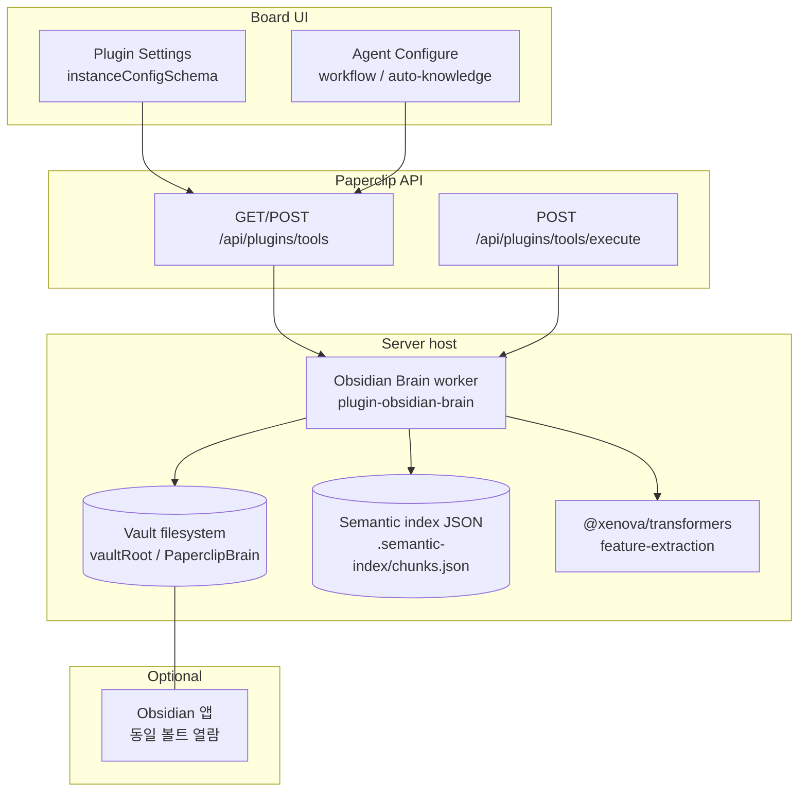
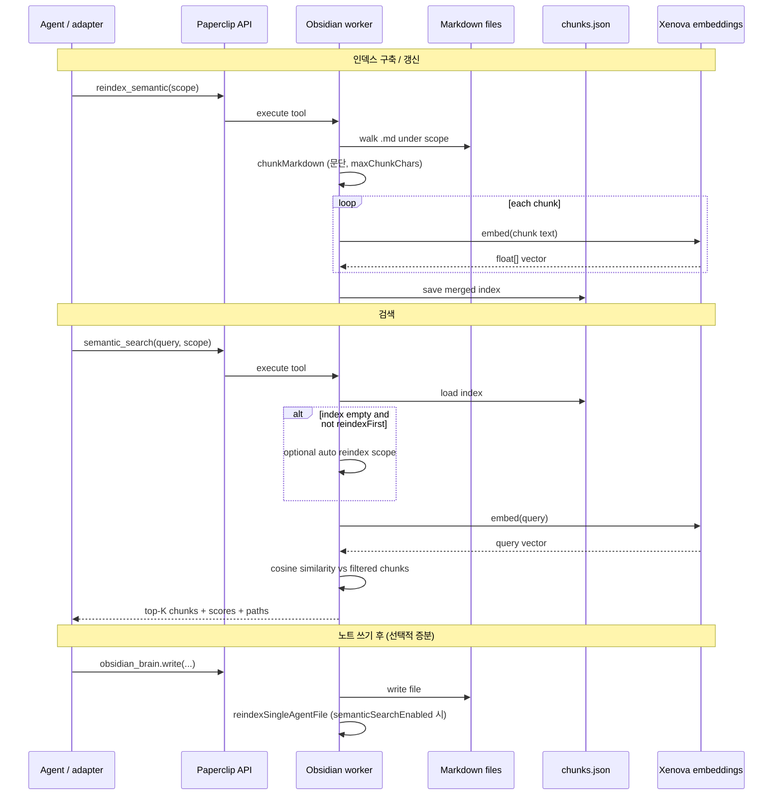

# Obsidian Brain 플러그인 · RAG 전 과정 아키텍처

Paperclip `paperclip.obsidian-brain` 플러그인이 Obsidian **볼트(폴더)** 위에서 마크다운을 읽고 쓰고, **로컬 임베딩 기반 시맨틱 검색(RAG)** 을 제공하는 구조를 한 장으로 정리한다. Obsidian 데스크톱 앱의 검색 엔진과는 **무관**하다.

---

## 1. 논리 구성 (레이어)



| 레이어 | 역할 |
|--------|------|
| **에이전트 설정** | `paperclipObsidianBrainWorkflowPrompt` / `paperclipObsidianBrainAutoKnowledge` → 하트비트 컨텍스트에 워크플로·AUTO-KNOWLEDGE 지시문 주입. `plugins.ts`에서 `obsidian_brain.*` 도구 노출 조건과 정렬. |
| **플러그인 인스턴스 설정** | `vaultRoot`, `brainSubdir`, `semanticSearchEnabled`, `maxChunkChars`, `embeddingModelId`, common 쓰기 정책 등. |
| **HTTP 도구 API** | 에이전트가 Bearer로 `obsidian_brain.read/write/.../semantic_search/reindex_semantic` 호출. |
| **워커** | 실제 파일 I/O, 인덱스 읽기/쓰기, 임베딩 파이프라인 실행. |
| **Obsidian 앱** | 같은 폴더를 볼트로 열면 사람이 노트를 편집 가능. Paperclip RAG는 앱 없이도 동작. |

---

## 2. 디스크 레이아웃 (회사 단위)

`vaultRoot` = 사용자가 지정한 Obsidian 볼트 절대 경로.

```
{vaultRoot}/                       # 플러그인 설정의 Obsidian 볼트 루트(반드시 절대 경로 권장)
  {brainSubdir}/                   # 기본값 PaperclipBrain — 볼트 루트의 *하위* 폴더
    {companyId}/                   # 회사 UUID
      agents/{agentId}/            # 에이전트 UUID — 여기가 obsidian_brain.write 의 기준 디렉터리
        troubleshooting/
          pip-88-obsidian-brain-smoke.md
      common/                      # 공유 노트
      .semantic-index/
        chunks.json                # RAG 인덱스 (청크 + 임베딩 벡터)
```

**`troubleshooting/pip-88-obsidian-brain-smoke.md` 는 어디에 생기나**

- 도구 파라미터 `relativePath: "troubleshooting/pip-88-obsidian-brain-smoke.md"` 는 **에이전트 브레인 루트** 기준 상대 경로이다.
- 디스크 절대 경로는 다음과 같다:

  `{vaultRoot}\{brainSubdir}\{companyId}\agents\{agentId}\troubleshooting\pip-88-obsidian-brain-smoke.md`

- 예: 볼트가 `...\obsidian-vault` 이고 `brainSubdir` 가 `PaperclipBrain` 이면, 파일은  
  `...\obsidian-vault\PaperclipBrain\<회사UUID>\agents\<에이전트UUID>\troubleshooting\...`  
  **`PaperclipBrain` 바로 아래가 아니라**, 그 아래 **`회사UUID\agents\에이전트UUID\`** 가 한 단계 더 있다.
- `obsidian_brain.write` 성공 시 API 응답 본문/데이터에 **`absolutePath`**(서버가 실제로 쓴 경로)가 포함된다. 탐색기에서는 그 문자열을 그대로 붙여 넣어 연다.

**절대 경로가 “안 먹는” 경우**

- 플러그인 설정의 **`vaultRoot` 는 Obsidian이 여는 볼트 폴더**여야 한다. `PaperclipBrain` 까지만 넣으면 레이아웃이 어긋난다.
- 상대 경로로 두면 **Paperclip 서버 프로세스의 현재 작업 디렉터리** 기준으로 풀리므로, 개발 PC의 볼트와 다를 수 있다. **항상 볼트 루트의 절대 경로**를 저장하는 것이 안전하다.

- **인덱스 파일**: `SemanticIndexFile` — `version`, `modelId`, `updatedAt`, `chunks[]` (각 청크에 `relFromCompany`, `chunkIndex`, `text`, `embedding`).
- 인덱스는 **회사(`companyId`) 단위** 하나; 스코프(`agent` / `common` / `both`)는 검색 시 경로 접두로 필터.

---

## 3. RAG 파이프라인 (전 과정)



### 3.1 청킹

- 마크다운을 빈 줄 기준 **문단**으로 분리 후 `maxChunkChars` 이하로 병합/분할 (`semantic-search.ts` `chunkMarkdown`).

### 3.2 임베딩

- `@xenova/transformers` `pipeline("feature-extraction", modelId)` — 기본 `Xenova/all-MiniLM-L6-v2` (`embeddingModelId`로 변경 가능).
- `pooling: "mean"`, `normalize: true` → 고정 길이 벡터.

### 3.3 검색

- 질의 문자열(최대 ~8000자 잘림) 임베딩 후, 인덱스의 각 청크와 **코사인 유사도** 비교, 스코프에 맞는 청크만 후보.
- 상위 `topK`(기본 5, 최대 15) 반환.

### 3.4 `semanticSearchEnabled === false`

- `semantic_search` / `reindex_semantic` 및 쓰기 후 증분 재인덱스 경로가 비활성(에러 또는 no-op).

---

## 4. Obsidian 앱 vs Paperclip RAG

| 구분 | Obsidian 앱 검색 | Paperclip Obsidian Brain RAG |
|------|------------------|-------------------------------|
| 인덱스 | 앱/플러그인별 (예: Omnisearch 등) | 서버 프로세스의 `chunks.json` + Xenova 임베딩 |
| 데이터 소스 | 볼트 내 파일 | **동일 볼트 경로**의 `PaperclipBrain/{companyId}/...` 트리 |
| 실행 위치 | 클라이언트 PC | **Paperclip 서버**(워커가 돌아가는 호스트) |

두 검색은 **동기화되지 않는다**. 같은 `.md`를 두 시스템이 읽을 뿐, 인덱스는 별개다.

---

## 4.1 운영 실패 모드 (PIP-87 요약) — “Vault에 안 남았다”

아래를 만족하지 않으면 지식이 **볼트에 저장되지 않거나** RAG가 **빈 인덱스**로 보인다.

| 원인 | 설명 | 올바른 조치 |
|------|------|-------------|
| **실행 환경 분리** | IDE(Cursor 등)만 돌고 `GET /api/plugins/tools`에 `obsidian_brain.*`가 없음 | 에이전트에 Obsidian 워크플로·또는 auto-knowledge 켜기; Paperclip 하트비트/런에서 API로 도구 호출. 워크스페이스에 직접 쓴 `.md`는 볼트와 다를 수 있음. |
| **경로 혼동** | PARA `memory/`, git 트리, `instructions/_role-context.md`만 갱신 | 동일 내용을 **`obsidian_brain.write`**로 에이전트 브레인 경로(`references/` 등)에 기록. |
| **`common/` 쓰기 거절** | `allowAllAgentsCommonWrite` false 이고 orchestrator 목록에 없음 | 플러그인 설정에서 허용 정책 조정 **또는** 에이전트 스코프(`references/`, `decisions/`)만 사용. |
| **RAG 미표시·미동작** | DB 매니페스트 구버전으로 UI에 `semanticSearchEnabled` 없음 | UI 스키마 보강(클라이언트) 또는 플러그인 업그레이드; `reindex_semantic`으로 인덱스 생성. |

프롬프트(`packages/adapter-utils` Obsidian 블록)와 `HEARTBEAT.md`에는 위 구분을 반복해 두었다.

---

## 5. 설정 키 요약

| 위치 | 키 | 의미 |
|------|-----|------|
| 플러그인 인스턴스 | `vaultRoot` | 볼트 절대 경로 (필수) |
| 플러그인 인스턴스 | `semanticSearchEnabled` | RAG 도구·증분 인덱스 허용 (기본 true) |
| 플러그인 인스턴스 | `maxChunkChars`, `embeddingModelId` | 청크 크기·임베딩 모델 |
| 에이전트 `adapterConfig` | `paperclipObsidianBrainWorkflowPrompt` | 워크플로 프롬프트 주입 |
| 에이전트 `adapterConfig` | `paperclipObsidianBrainAutoKnowledge` | AUTO-KNOWLEDGE 지시문 + 도구 허용 |

---

## 6. 관련 코드 (진입점)

| 영역 | 경로 |
|------|------|
| 인덱스·검색·재인덱스 | `packages/plugins/plugin-obsidian-brain/src/semantic-search.ts` |
| 도구 등록 | `packages/plugins/plugin-obsidian-brain/src/worker.ts` |
| 볼트 경로 해석 | `packages/plugins/plugin-obsidian-brain/src/brain-paths.ts` |
| 매니페스트 스키마 | `packages/plugins/plugin-obsidian-brain/src/manifest.ts` |
| 에이전트 도구 권한 | `server/src/routes/plugins.ts` |
| 하트비트 프롬프트 | `server/src/services/obsidian-brain-workflow-prompt.ts`, `server/src/services/heartbeat.ts` |

이 문서는 제품/운영 관점의 아키텍처 스냅샷이며, 구현 세부는 코드가 우선이다.
