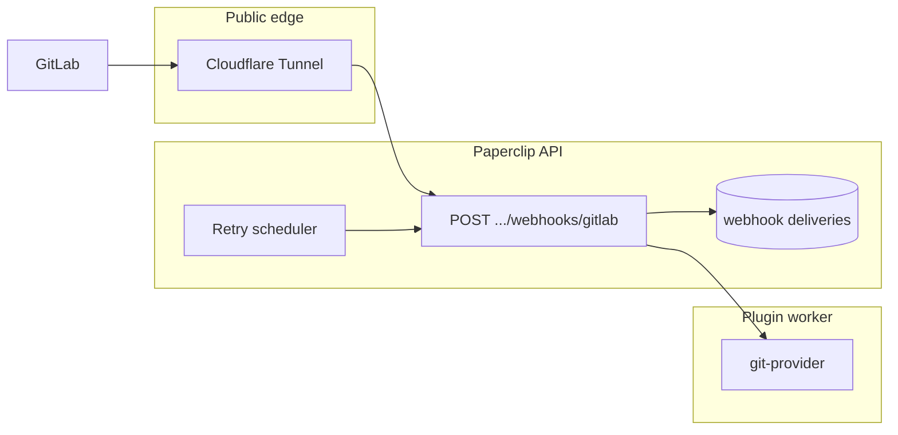

# 포트폴리오 — Paperclip 서버 개조·GitLab·Obsidian·토큰 최적화

> **한 줄 요약:** 로컬에만 있던 Paperclip API를 **Cloudflare Tunnel로 공인 노출**하고 **웹훅 수신·재시도·진단**까지 묶었습니다. 이어 **GitLab REST 연동 플러그인**(MR·이슈·파이프라인·승인 웹훅)과 **Obsidian Vault 기반 지식 베이스 플러그인**을 붙였고, 에이전트 입력 쪽에서는 **하트비트 다이제스트 상한**으로 **토큰 사용을 제어**했습니다.

**저장소:** Paperclip 모노레포 (TypeScript, Express, PostgreSQL/Drizzle, 플러그인 워커)  
**전체 맵(경로·API 나열):** [`INTEGRATION-ORCHESTRATION-SUMMARY.md`](./INTEGRATION-ORCHESTRATION-SUMMARY.md)  
**오케스트레이션 관점 포트폴리오:** [`PORTFOLIO-Paperclip-Orchestration.md`](./PORTFOLIO-Paperclip-Orchestration.md)

---

## 1. 서버 개조 — Cloudflare Tunnel · 웹훅

### 무엇을 해결했는가

- 로컬 개발 서버는 외부 SaaS(GitLab 등)가 **HTTPS 콜백**을 보낼 수 없어, 웹훅 연동이 불가능에 가깝습니다.
- 웹훅은 **한 번 실패하면 끝**이면 운영이 어렵고, 리버스 프록시 뒤에서는 **클라이언트가 보는 URL**과 **실제 API 오리진**이 어긋나 링크·검증이 깨집니다.

### 내가 구현·정리한 내용

1. **공인 진입점 (Cloudflare Tunnel)**  
   `cloudflared`로 로컬 API 포트를 고정 호스트네임에 매핑하고, GitLab 웹훅 URL에 **전체 경로**(`/api/plugins/<id>/webhooks/gitlab`)까지 포함해 등록하는 흐름을 문서화·검증했습니다. (Quick 터널 vs Zero Trust 고정 도메인 구분 포함 — [`GITLAB-APPROVAL-SYNC.md`](./GITLAB-APPROVAL-SYNC.md), Linear 브리지 문서와 동일한 터널 패턴.)

2. **퍼블릭 베이스 URL (`PAPERCLIP_PUBLIC_BASE_URL`)**  
   API 프로세스에 **scheme + host만** 두고, 보드·플러그인 상세에서 노출되는 웹훅 베이스가 터널/프록시와 일치하도록 맞췄습니다. DNS 이름 혼동(예: 서로 다른 서브도메인)으로 502가 나는 케이스를 체크리스트로 정리했습니다.

3. **웹훅 기능 (호스트 측)**  
   - 인바운드: `POST /api/plugins/:pluginId/webhooks/:endpointKey` — 플러그인 매니페스트의 `endpointKey`와 정합.  
   - **배달 영속화**(`plugin_webhook_deliveries`): 페이로드·헤더·상태·`retryCount` / `nextRetryAt`.  
   - **실패 시 백오프 재시도 루프**(예: 30s → 2m → 10m → 1h, 상한 5회)로 워커 일시 오류를 흡수.  
   - **진단 API**: 배달 이력 조회, 테스트 전송, 수동 재시도, 브라우저 GET으로 URL sanity check.  
   - **본문 파싱**: Slack 등 `urlencoded`와 JSON 모두에서 **raw body**를 남겨 서명 검증이 가능하도록 Express 미들웨어를 정리했습니다 (`server/src/app.ts`).

4. **502 트러블슈팅 구분**  
   Cloudflare **엣지 502**(text/plain, `error code: 502`)와, 요청이 API까지 도달한 뒤의 **JSON 에러 응답**을 문서에서 분리해, 인프라 vs 애플리케이션 원인 진단 시간을 줄였습니다.

---

## 2. GitLab 플러그인 — REST API 연동

### 내가 구현·확장한 범위 (`paperclip.git-provider`)

- **인증·설정:** GitLab PAT는 설정 JSON에 직접 넣지 않고 **`company_secrets` 행 UUID**(`gitlabTokenRef`)로만 참조. 웹훅 검증용 시크릿도 동일 패턴(`gitlabWebhookSecretRef`, UI에서 웹훅 시크릿 생성 시 연동).
- **에이전트 도구 (GitLab REST):** MR 생성, 이슈 조회·노트·라벨/상태 갱신, 파이프라인 목록·상태, MR 디스커션 목록 등 — 에이전트가 이슈·CI·리뷰 스레드를 코드와 같은 컨텍스트에서 다루도록 했습니다.
- **MR ↔ Paperclip 승인 브리지:** GitLab **Merge request** 웹훅(`X-Gitlab-Token` 검증)으로 `approved` / `unapproved` 액션을 받아, MR 생성 시 매핑해 둔 Paperclip 승인을 **멱등**으로 해소. MR 생성 도구 인자에 `paperclipIssueId` / `paperclipApprovalId`를 두어 추적 키를 연결했습니다.
- **운영 문서:** 시크릿 UUID vs GitLab UI의 raw Secret token 혼동 방지, 터널 URL 예시, 계약 필드 — [`GITLAB-APPROVAL-SYNC.md`](./GITLAB-APPROVAL-SYNC.md).
- **런타임 프롬프트(선택):** 에이전트가 GitLab 연동 안내를 켜면, 회사에 플러그인이 활성일 때만 통합 가이드 마크다운을 실행 프롬프트에 합성 (`gitlab-integration-prompt.ts` + adapter-utils 마크다운).

---

## 3. Obsidian 플러그인 — 지식 베이스 연동

### 내가 구현한 방향 (`paperclip.obsidian-brain`)

- **지식 베이스 레이아웃:** Paperclip 전용 트리 `PaperclipBrain/{companyId}/agents/{agentId}/` 및 `common/` — 에이전트별 노트와 팀 공유 영역을 파일 시스템으로 분리.
- **도구:** `list` / `read` / `write` / `append` / `write_common` — wikilink로 노트 간 연결, `common` 쓰기는 옵션·오케스트레이터 에이전트 ID로 제한 가능.
- **설정:** `vaultRoot`는 **서버가 보는 절대 경로**로 고정(상대 경로는 cwd에 묶여 잘못된 Vault로 붙는 문제 방지). 프로젝트 샌드박스 경로면 UI에서 경고.
- **거버넌스:** “전부 읽기”가 아니라 **list → 필요한 1~2개 read** 순서를 워크플로 문서로 권장해 컨텍스트 폭발을 줄임 — [`OBSIDIAN-BRAIN.md`](./OBSIDIAN-BRAIN.md).
- **선택적 프롬프트 주입:** 에이전트 설정에서 워크플로 스위치를 켜면, 플러그인이 회사에서 켜져 있을 때만 Obsidian 사용 지시를 하트비트/런 프롬프트에 붙임 (`obsidian-brain-workflow-prompt.ts`). 도구 호출을 강제하지는 않음.

---

## 4. 토큰 최적화

### 내가 적용한 방식

1. **하트비트 이슈 다이제스트 상한**  
   로컬 CLI 어댑터 stdin에 넣는 “작업 지시” 블록에서  
   - 이슈 본문 최대 **12,000자**,  
   - 트리거 코멘트 본문 최대 **8,000자**  
   초과분은 잘라 `…[truncated]`로 표시 (`server/src/services/heartbeat-issue-digest.ts` — 주석에 *token guard* 명시).  
   → 이슈/코멘트가 매우 길어도 **모델 입력 토큰이 무한정 커지지 않도록** 상한을 코드 상수로 고정했습니다.

2. **Obsidian 쪽 행동 가이드**  
   문서화된 워크플로: 작업 시작 시 전체 폴더를 읽지 않고 `list` 후 선택적 `read`, 노트는 짧게 유지 — **RAG/파일 도구**를 쓸 때 흔한 “한 번에 다 읽기” 패턴을 피하도록 설계했습니다.

3. **(부가)** 시크릿·자격증명은 프롬프트가 아니라 **시크릿 저장소 참조**만 노출 — 설정 JSON에 긴 토큰 문자열이 반복되지 않도록 했습니다(보안과 함께 로그·디버그 출력 노이즈 감소).

---

## 5. 기술 스택 (이 프로젝트에서 실제로 건드린 것)

| 층 | 기술 |
|----|------|
| 런타임 | TypeScript, Node.js, Express |
| 데이터 | PostgreSQL, Drizzle, `plugin_webhook_deliveries` |
| 인프라 | Cloudflare Tunnel (`cloudflared`), `PAPERCLIP_PUBLIC_BASE_URL` |
| 연동 | GitLab REST + Merge Request 웹훅, Obsidian Vault(로컬 FS) |
| 플러그인 | 매니페스트 `webhooks` + `secrets.read-ref` + 워커 `handleWebhook` / 도구 |

---

## 6. 면접·이력서용 한 문장 (예시)

- *“Paperclip API를 Cloudflare Tunnel과 퍼블릭 베이스 URL 설정으로 외부 웹훅에 노출하고, 배달 저장·백오프 재시도·진단 API까지 포함한 웹훅 경로를 정리했습니다. GitLab REST·MR 승인 웹훅 플러그인과 Obsidian Vault 지식 베이스 플러그인을 연결했으며, 하트비트 다이제스트에 문자 상한을 두어 에이전트 입력 토큰을 제어했습니다.”*

---

## 7. 참고 문서

| 문서 | 내용 |
|------|------|
| [`GITLAB-APPROVAL-SYNC.md`](./GITLAB-APPROVAL-SYNC.md) | 터널 URL, `PAPERCLIP_PUBLIC_BASE_URL`, 웹훅 시크릿, 502 구분 |
| [`OBSIDIAN-BRAIN.md`](./OBSIDIAN-BRAIN.md) | Vault 트리, 도구, 토큰 절약 워크플로 |
| [`INTEGRATION-ORCHESTRATION-SUMMARY.md`](./INTEGRATION-ORCHESTRATION-SUMMARY.md) | 저장소 전체 모듈 맵 |
| [`PORTFOLIO-Paperclip-Orchestration.md`](./PORTFOLIO-Paperclip-Orchestration.md) | 통합·하트비트·에스컬레이션·스킬(면접용) |
| [`plans/2026-04-04-token-secret-hardening.md`](./plans/2026-04-04-token-secret-hardening.md) | 시크릿·토큰 운영 게이트(참고) |

---

*본 문서는 위 네 축을 제가 구현·문서화한 범위 위주로 재구성한 포트폴리오용 요약입니다. 세부 동작은 코드와 링크된 doc을 기준으로 합니다.*
